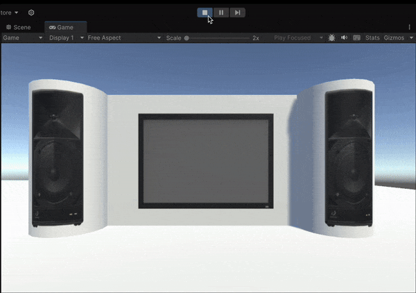

# Práctica Micrófono y Cámara
En esta práctica vamos a aprender a usar componentes de entrada con Unity 3D, en específico micrófono y cámara. 

### Datos del Alumno
- Igor Dragone
- alu0101469652@ull.edu.es

## Ejercicios de Micrófono

### Ejercicio 1
Para el primer ejercicio partimos de la escena de las arañas en las que estas se mueven hacia los huevos al contactar el cubo con ellas. Nuestro objetivo es añadir un sonido de masticación cuando la araña alcance el huevo. Para ello creamos un objeto de tipo `Audio Source` y en el inspector le asignamos el sonido de la carpeta adjunta. Luego creamos un script que reproduzca el sonido cuando la araña colisione con el huevo, a través del método `Play()`

https://github.com/user-attachments/assets/78bdb1c6-6d3a-4cfd-b489-78bc47a8d2f3

### Ejercicio 2
En este ejercicio queremos simular un verdadero sistema microfono-altavoces, que captura lo que decimos a través del primero y lo amplifica, transmitiendo la salida por los segundos en tiempo real. Para ello usamos el módulo `Microphone`, que cuenta con métodos y atributos como:
- `devices`, devuelve la lista de dispositivos disponibles como microfonos
- `Start`, comienza a grabar nuestra voz, en nuestro caso cuando pulsamos la R
- `End`, deja de grabar, en nuestro caso cuando levantamos la R

https://github.com/user-attachments/assets/ec4e9da7-cef1-46ff-b9ca-1eb85c192ecd

## Ejercicios de Cámara

### Ejercicio 3
En este ejercicio seguimos con la escena de la pantalla y los altavoces. En este caso lo que queremos es que en la pantalla aparezca lo que capture nuestra webcam. Además, según la tecla que pulsemos, podemos arrancar la cámara ("s"), detenerla ("p") o tomar la foto ("x"). Para ello usamos el módulo `WebCamTexture`, con sus métodos Play(), Stop(). Para que en la pantalla aparezca el fotograma, cambiamos el material de esta a través del Renderer, asignandole o la textura de la webcam ("s") o la del fotograma tomado ("x")

### Ejercicio 4
Para este ejercicio simplemente añadimos un Debug.Log con el nombre de la camara, al que podemos acceder a través de `WebCamTexture.devices`. Normalmente nos interesa el nombre del primer elemento, es decir `WebCamTexture.devices[0].name`

### Ejercicio 5
