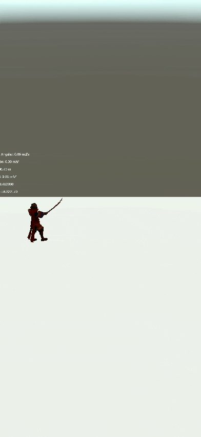

# Práctica Sensores
En esta práctica vamos a aprender a usar sensores con Unity 3D, en específico GPS, brújula y acelerómetro.

### Datos del Alumno
- Igor Dragone
- alu0101469652@ull.edu.es

## Ejercicio 1
En este primer ejercicio vamos a mostrar en la UI los velores de:
- **Velocidad Angular**. Usamos `Input.gyro.rotationRate;`
- **Aceleración**. Usamos `Input.acceleration`
- **Gravedad**. Usamos una constante `9.81`
- **Latitud, Longitud y Altitud**. Usamos `Input.location.lastData.<latitude/longitude/altitude>`
  
### Valores en el laboratorio

### Valores en el jardín

## Ejercicio 2
En este segundo ejercicio añadimos el prefab de un samurai a la escena y tenemos que conseguir que este:
- Se oriente hacia el Norte. Usiamo `Input.compass.trueHeading`, que nos devuelve la orientacón Norte. 
- Avance con una aceleración proporcional a la del dispositivo. Usamos `Input.acceleration` y el método Translate
- Se pare cuando el dispositivo esté fuera de un rango de latitud, longitud dado. Usamos `Input.location.lastData`. Elegimos los límites de langitud y longitud con el rango (28,28.5) y (-16.5, -16) respectivamente.

