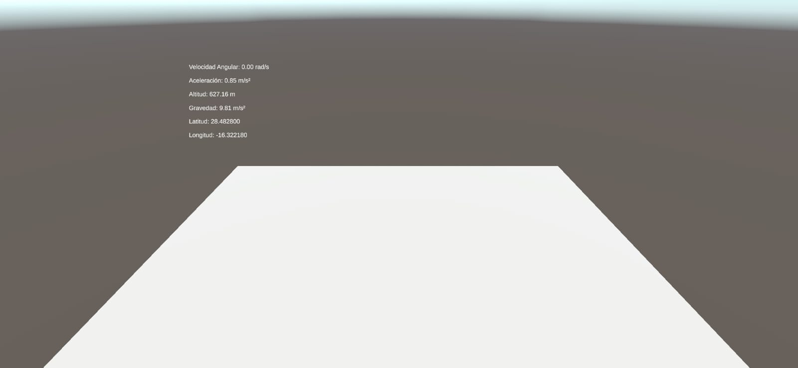

# Práctica Sensores
En esta práctica vamos a aprender a usar sensores con Unity 3D, en específico GPS, brújula y acelerómetro.

### Datos del Alumno
- Igor Dragone
- alu0101469652@ull.edu.es

## Ejercicio 1
En este primer ejercicio vamos a mostrar en la UI los velores de:
- **Velocidad Angular**.
- **Aceleración**.
- **Gravedad**.
- **Latitud, Longitud y Altitud**.
  
### Valores en el laboratorio

### Valores en el jardín

## Ejercicio 2

