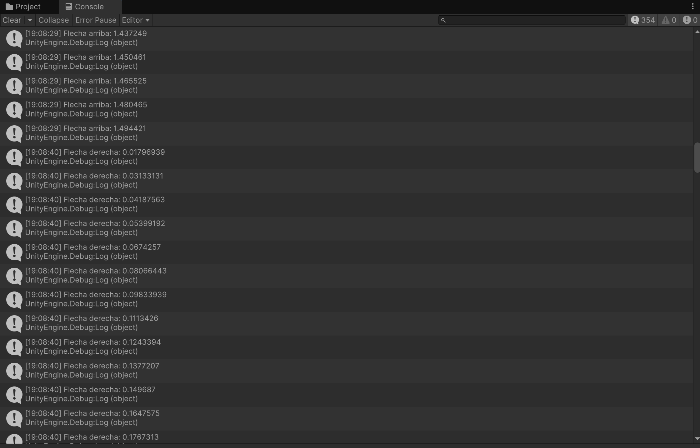
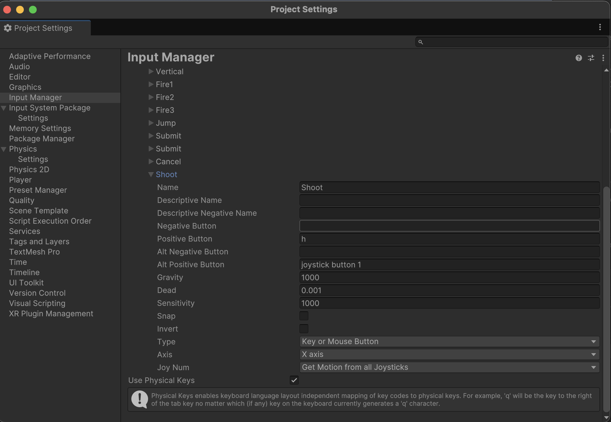

# Práctica 3 - Movimientos y Física
En esta práctica vamos a aprender conceptos sobre la física y los movimientos en Unity

### Datos del Alumno
- Igor Dragone
- alu0101469652@ull.edu.es

## Parte 1 - Experimentos de física
Vamos a crear una escena con un plano, un cubo y una esfera. Con este vamos a experimentar con diferentes configuraciones de los components Rigidbody y Collider
### 1. Cubo como objeto físico, plano y esfera no
Para configurar esta escena, hay que añadir Rigidbody únicamente al cubo. Al ejecutarla, no pasa nada, debido a que el plano y la esfera no son obejtos sujetos a la física y el cubo ya se encuentra encima del plano, luego la gravedad no le afectaría.
### 2. Cubo y esfera como objetos físicos, plano no
Para configurar esta escena, hay que añadir Rigidbody tanto al cubo como a la esfera. En este caso la esfera caerá sobre el cubo y el plano, que no se moverán. 
### 3. Cubo como objeto físico, plano no y esfera cinemática
Para configurar esta escena, hay que añadir Rigidbody tanto al cubo como a la esfera. Además, en el componente Rigidbody de la esfera debemos marcar la opción "Is Kinematic". Al ejecutarlo, no pasa nada, ya que hacer la esfera cinemática significa que no será afectada por la gravedad ni otras fuerzas físicas
### 4. Plano, cubo y esfera como objetos físicos
Para configurar esta escena, hay que añadir Rigidbody a todos los objetos de la escena. Al ejecutarlo, todos los objetos se verán sujetos a la fuerza de gravedad y caerán.
### 5. Plano, cubo y esfera como objetos físicos, esfera con 10 veces más masa que el cubo
Podemos modificar la masa de la esfera en el componente Rigidbody, directamente desde el inspector. Vamos a considerar dos variaciones para el plano:
- Plano no cinemático: en este caso, todos los objetos caerán al vacío
- Plano cinemático: en este caso, la esfera caerá sobre el cubo y, al tener una masa 10 veces mayor, va a moverlo ligermente, pero sin conseguir desplazarlo.
### 6. Plano, cubo y esfera como objetos físicos, esfera con 100 veces más masa que el cubo
Vamos a considerar dos variaciones para el plano:
- Plano no cinemático: en este caso, todos los objetos caerán al vacío
- Plano cinemático: en este caso, la esfera caerá sobre el cubo y, al tener una masa 100 veces mayor, va a desplazarlo.
### 7. Plano, cubo y esfera como objetos físicos, esfera con fricción
Podemos añadir fricción a la esfera de la siguiente forma: primero creamos un nuevo material de física, luego cambiamos los valores de fricción por los elegidos y por último le asignamos este material al componente Collider de la esfera. Al ejecutar, no podemos apreciar grandes cambios en el comportamiento de la esfera: aunque hayas aumentado su fricción, esta sigue cayendo encima del cubo y rodando por el plano.
### 8. Plano y cubo como objetos físicos, esfera como objeto no físico y con Trigger
Podemos añadir convertir la esfera en Trigger desde el componente Collider, marcando en el inspector la opción "Is Trigger". Al ejecutar, dado que la esfera no es un objeto físico, no va a pasar nada. 
### 9. Plano, cubo y esfera como objetos físicos, esfera con Trigger
En este caso la esfera caerá sobre cubo y plano, pero al ser Trigger los atravesará. 

## Parte 2 - Ejercicios
Es el momento de realizar los ejercicios:

### Ejercicio 1
En el primer ejercicio vamos a mostrar por consola el resultado de multiplicar la velocidad (variable pública) por el valor del eje vertical y por el valor del eje horizontal cada vez que se pulsan las teclas flecha arriba-abajo ó flecha izquierda-derecha. Los valores de eje están entre -1 y 1 y los obtenemos con `Input.GetAxis()`. Para velocidad = 5, la consola se vería así:

### Ejercicio 2
Para mapear la tecla H a la función disparo, entramos en el Input Manager: `edit -> Project Settings -> Input Manager`. Ahí duplicamos el último eje, le cambiamos el nombre a Shoot y le asignamos la tecla H:

### Ejercicio 3
Para este ejercicio necesitamos dos variables públicas: `speed`, que indicará la velocidad(debe ser mayor que 1) y `moveDirection` , un Vector3 que indicará la dirección del movimiento. Al ejecutarlo, el cubo se moverá hacia la dirección indicada por el vector a la velocidad elegida. Al no usar Time.deltaTime, el movimiento no será nada fluido. Ahora analizamos 3 situaciones:
- Si duplicamos las coordenadas de moveDirection, el cubo se moverá el doble de rápido en la misma dirección, cubriendo más distancia por fotograma.
- Si duplicamos la velocidad, el cubo también se moverá más rápido en la misma dirección
- Si la velocidad que usamos es menor que 1, el cubo se moverá más lentamente, cubriendo menos distancia en cada fotograma.
- Si y > 0, el cubo se moverá de acuerdo con moveDirection, pero comenzará desde una posición más alta
- Si intercambiamos el movimiento relativo al sistema de referencia local, el cubo se moverá en la dirección definida por su orientación actual. Por otro lado, si es el sistema de referencia global, se moverá en la misma dirección global, sin importar su orientación.

### Ejercicio 4
En este ejercicio vamos a mover el cubo con las flechas y la esfera con wasd. Para ello, modificamos `moveDirection` para que dependa de los inputs en el eje vertical y horizontal, en el caso del cubo, o de wasd, en el caso de la esfera. Al ejecutarlo, vemos que el movimiento sigue sin ser fluido. Este problema podemos arreglarlo en el siguiente ejercicio. Además, al usar wasd también se mueve el cubo, pues así está definido en el input manager. Podemos cambiarlo eliminando el botón positivo alternativo

### Ejercicio 5
Solucionamos el problema de la fluidez usando `Time.deltaTime`, que nos permite que que el movimiento del cubo y la esfera sean proporcionales al tiempo que ha transcurrido desde el último frame. 

### Ejercicio 6
