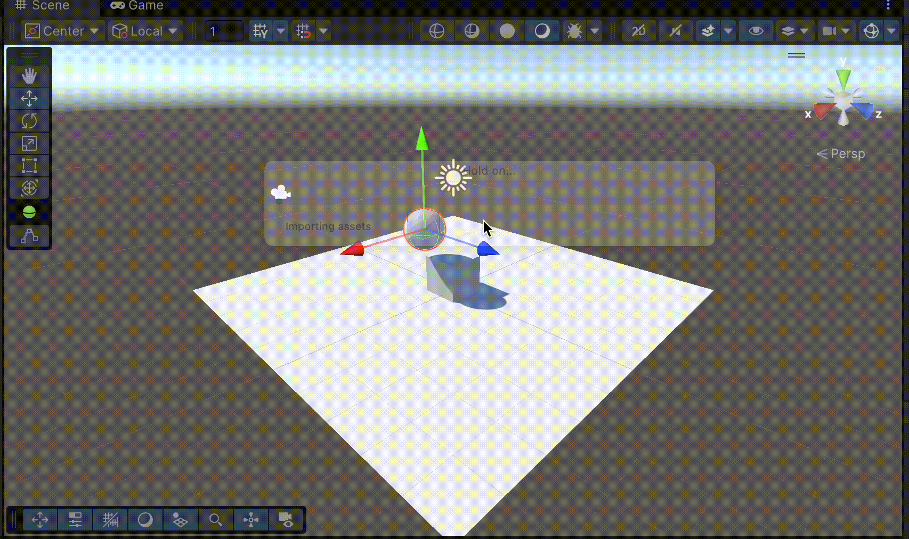
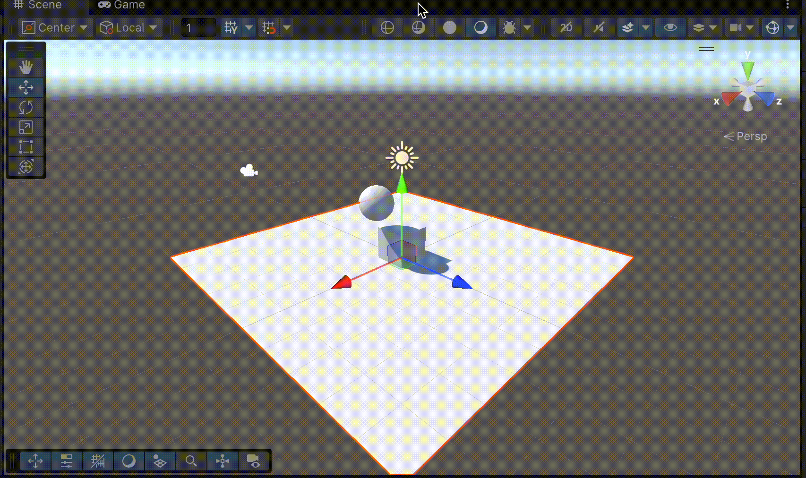
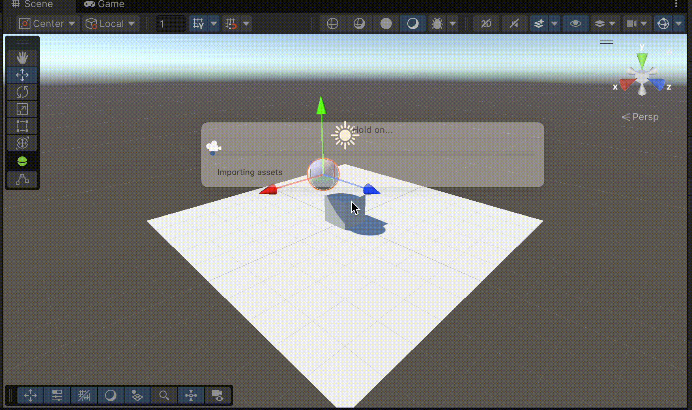
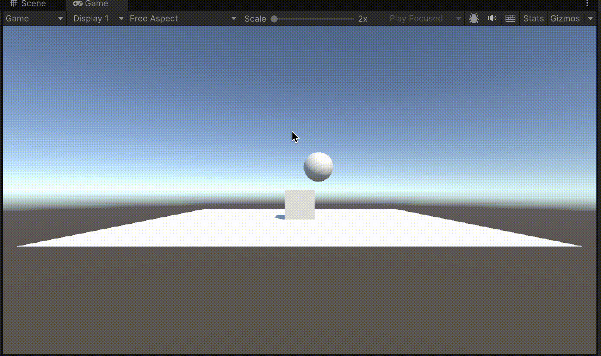
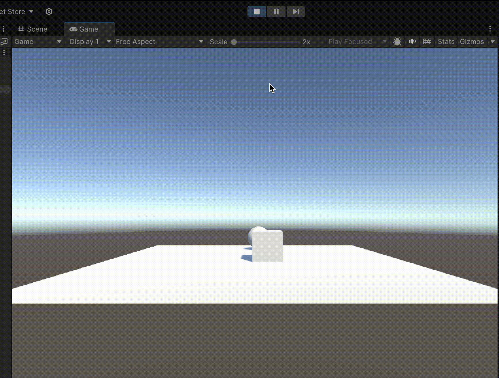
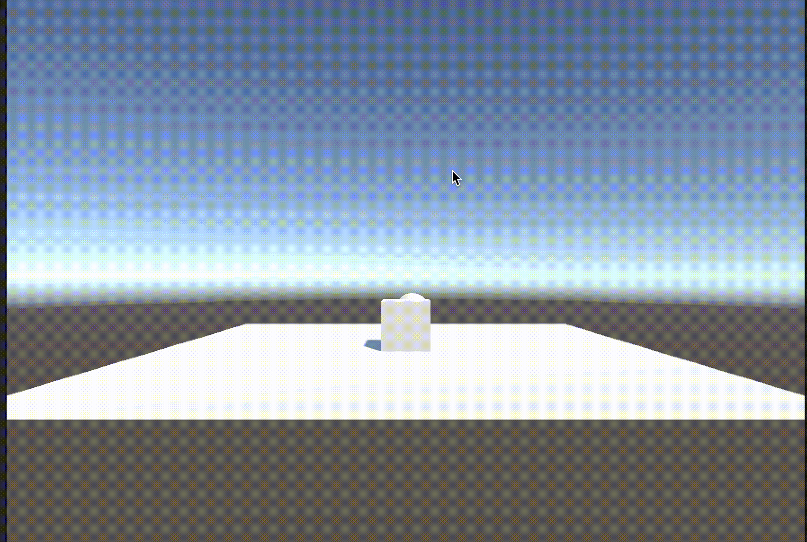
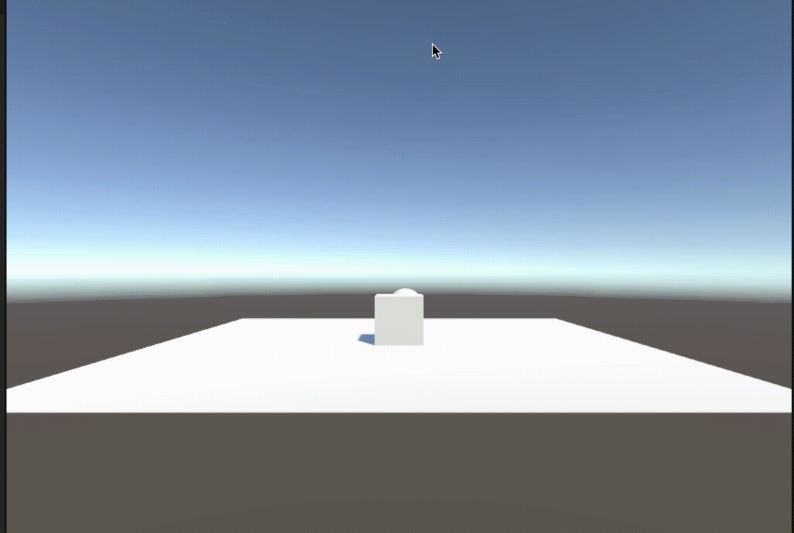

# Práctica 3 - Movimientos y Física
En esta práctica vamos a aprender conceptos sobre la física y los movimientos en Unity

### Datos del Alumno
- Igor Dragone
- alu0101469652@ull.edu.es

## Parte 1 - Experimentos de física
Vamos a crear una escena con un plano, un cubo y una esfera. Con este vamos a experimentar con diferentes configuraciones de los components Rigidbody y Collider
### 1. Cubo como objeto físico, plano y esfera no
Para configurar esta escena, hay que añadir Rigidbody únicamente al cubo. Al ejecutarla, no pasa nada, debido a que el plano y la esfera no son obejtos sujetos a la física y el cubo ya se encuentra encima del plano, luego la gravedad no le afectaría.
### 2. Cubo y esfera como objetos físicos, plano no
Para configurar esta escena, hay que añadir Rigidbody tanto al cubo como a la esfera. En este caso la esfera caerá sobre el cubo y el plano, que no se moverán. 

### 3. Cubo como objeto físico, plano no y esfera cinemática
Para configurar esta escena, hay que añadir Rigidbody tanto al cubo como a la esfera. Además, en el componente Rigidbody de la esfera debemos marcar la opción "Is Kinematic". Al ejecutarlo, no pasa nada, ya que hacer la esfera cinemática significa que no será afectada por la gravedad ni otras fuerzas físicas
### 4. Plano, cubo y esfera como objetos físicos
Para configurar esta escena, hay que añadir Rigidbody a todos los objetos de la escena. Al ejecutarlo, todos los objetos se verán sujetos a la fuerza de gravedad y caerán.

### 5. Plano, cubo y esfera como objetos físicos, esfera con 10 veces más masa que el cubo
Podemos modificar la masa de la esfera en el componente Rigidbody, directamente desde el inspector. Vamos a considerar dos variaciones para el plano:
- Plano no cinemático: en este caso, todos los objetos caerán al vacío
- Plano cinemático: en este caso, la esfera caerá sobre el cubo y, al tener una masa 10 veces mayor, va a moverlo ligermente, pero sin conseguir desplazarlo.
### 6. Plano, cubo y esfera como objetos físicos, esfera con 100 veces más masa que el cubo
Vamos a considerar dos variaciones para el plano:
- Plano no cinemático: en este caso, todos los objetos caerán al vacío
- Plano cinemático: en este caso, la esfera caerá sobre el cubo y, al tener una masa 100 veces mayor, va a desplazarlo.

### 7. Plano, cubo y esfera como objetos físicos, esfera con fricción
Podemos añadir fricción a la esfera de la siguiente forma: primero creamos un nuevo material de física, luego cambiamos los valores de fricción por los elegidos y por último le asignamos este material al componente Collider de la esfera. Al ejecutar, no podemos apreciar grandes cambios en el comportamiento de la esfera: aunque hayas aumentado su fricción, esta sigue cayendo encima del cubo y rodando por el plano.
### 8. Plano y cubo como objetos físicos, esfera como objeto no físico y con Trigger
Podemos añadir convertir la esfera en Trigger desde el componente Collider, marcando en el inspector la opción "Is Trigger". Al ejecutar, dado que la esfera no es un objeto físico, no va a pasar nada. 
### 9. Plano, cubo y esfera como objetos físicos, esfera con Trigger
En este caso la esfera caerá sobre cubo y plano, pero al ser Trigger los atravesará. ç

## Parte 2 - Ejercicios
Es el momento de realizar los ejercicios:

### Ejercicio 1
En el primer ejercicio vamos a mostrar por consola el resultado de multiplicar la velocidad (variable pública) por el valor del eje vertical y por el valor del eje horizontal cada vez que se pulsan las teclas flecha arriba-abajo ó flecha izquierda-derecha. Los valores de eje están entre -1 y 1 y los obtenemos con `Input.GetAxis()`. Para velocidad = 5, la consola se vería así:

### Ejercicio 2
Para mapear la tecla H a la función disparo, entramos en el Input Manager: `edit -> Project Settings -> Input Manager`. Ahí duplicamos el último eje, le cambiamos el nombre a Shoot y le asignamos la tecla H:

### Ejercicio 3
Para este ejercicio necesitamos dos variables públicas: `speed`, que indicará la velocidad(debe ser mayor que 1) y `moveDirection` , un Vector3 que indicará la dirección del movimiento. Al ejecutarlo, el cubo se moverá hacia la dirección indicada por el vector a la velocidad elegida. Al no usar Time.deltaTime, el movimiento no será nada fluido. Ahora analizamos 3 situaciones:
- Si duplicamos las coordenadas de moveDirection, el cubo se moverá el doble de rápido en la misma dirección, cubriendo más distancia por fotograma.
- Si duplicamos la velocidad, el cubo también se moverá más rápido en la misma dirección
- Si la velocidad que usamos es menor que 1, el cubo se moverá más lentamente, cubriendo menos distancia en cada fotograma.
- Si y > 0, el cubo se moverá de acuerdo con moveDirection, pero comenzará desde una posición más alta
- Si intercambiamos el movimiento relativo al sistema de referencia local, el cubo se moverá en la dirección definida por su orientación actual. Por otro lado, si es el sistema de referencia global, se moverá en la misma dirección global, sin importar su orientación.

### Ejercicio 4
En este ejercicio vamos a mover el cubo con las flechas y la esfera con wasd. Para ello, modificamos `moveDirection` para que dependa de los inputs en el eje vertical y horizontal, en el caso del cubo, o de wasd, en el caso de la esfera. Al ejecutarlo, vemos que el movimiento sigue sin ser fluido. Este problema podemos arreglarlo en el siguiente ejercicio. Además, al usar wasd también se mueve el cubo, pues así está definido en el input manager. Podemos cambiarlo eliminando el botón positivo alternativo

### Ejercicio 5
Solucionamos el problema de la fluidez usando `Time.deltaTime`, que nos permite que que el movimiento del cubo y la esfera sean proporcionales al tiempo que ha transcurrido desde el último frame. 

### Ejercicio 6
En este ejercicio vamos a cambiar la forma en la que se mueve el cubo: en vez de manejarlo con flechas, vamos a hacer que siga a la esfera. Para ello, debemos sacar el vector de dirección de movimiento, restando la posición del cubo a la de la esfera. Es importante asignarle a la y de este vector el valor 0, pues no queremos que el cubo suba o baje. Luego, este vector debe ser normalizado, para que el avance no dependa de la distancia entre ambos objetos.

### Ejercicio 7
Vamos a hacer que el cubo gire hacia la esfera, para que su "forward" siempre sea hacia la esfera. Para ello usamos el método `LookAt`, que rota el objeto. Al tener el forward del cubo siempre apuntando a la esfera, nos bastarà modificar únicamente `transform.forward` para conseguir que el cubo siga a la esfera. Para ver mejor el efecto de la rotación, hemos modificado el comportamiento de la esefra, que se moverá en los ejes X-Z.

### Ejercicio 8
En este ejercicio, la rotación del objeto dependerá del eje horizontal. El objeto siempre se moverá hacia delante, lo único que podemos controlar nosotros con las flechas es la rotación de este.

### Ejercicio 9
Para este ejercicio vamos a crear un cilindro como objeto físico, es decir, con RigidBody. El objetivo es imprimir un mensaje por pantalla cuando la esfera o el cubo colisionen con él. Para esto, usamos el evento `OnCollisionEnter` con una colisión como argumento y los tags asignados a cada objeto para saber qué objeto ha colisionado con el cilindro. Para ver más resultados, he creado dos escenarios posibles:
1. Cubo y esfera se mueven hacia el cilindro. Al ejecutar nos damos cuenta que, dado que ni esfera ni cubo son objetos físicos, estos atraviesan al cilindro, por lo que resulta más difícil detectar las colisiones.
2. El cilindro se mueve hacia el cubo y la esfera. En este caso, las detecciones de colisiones resultan más fáciles. Sin embargo, hay que tener en cuenta una cosa importante: al ser el cilindro un objeto físico, no podemos cambiar su posición con Transform, así que tendremos que usar `AddForce` del componente `RigidBody`. Al ejecutarlo vemos que el cilindro se choca con esos objetos y se imprime el mensaje en la terminal

### Ejercicio 10
En este ejercicio convertimos ambos objetos en físicos, con el cubo siendo cinemático. Al ser ahora todos físicos, no van a ser movidos por transform, sino por AddForce. Volvemos a nuestros dos escenarios:
1. Cubo y esfera se mueven hacia el cilindro. El cubo, al ser cinemático, no puede ser movido por AddForce. Por otro lado, la esfera si puede moverse y colisiona claramente con el cilindro, moviéndolo.
2. El cilindro se mueve hacia el cubo y la esfera. En este caso consigue desplazar a la esfera pero no al cubo.

### Ejercicio 11
En este ejercicio configuramos el cilindro para que sea de tipo Trigger. Esto permitirá que el cilindro detecte cuándo otros objetos atraviesan su collider sin una colisión física completa. Para evitar que se caiga, hacemos que sea cinemático. Modificamos el script cambiando el evento, usando esta vez `OnTriggerEnter` con un Collider como argumento. Al ser Trigger, los objetos van a atravesar el cilindro:

### Ejercicio 12
En este ejercicio vamos a añadir un cilindro(con color diferente al otro) como objeto físico. Vamos a configurarlo para poder controlar su movimiento a través de wasd. El objetivo del ejercicio es estudiar la interacción de este cilindro con una esfera en diversas situaciones:
- Esfera con masa 10 veces mayor. En este caso el cilindro tendrá mayor dificultad para mover la esfera.
- Esfera con masa 10 veces menor. En este caso el cilindro será capaz de empujar la esfera con facilidad. La esfera se moverá más rápido y será más fácil de desplazar.
- Esfera cinemática. En este caso la esfera no reaccionará a las fuerzas aplicadas por el cilindro y permanecerá inmóvil.
- Esfera como trigger. En este caso no habrá colisión física, el cilindro atravesarà a la esfera. 
- Cilindro con fricción duplicada. En este caso el cilindro se moverá más lentamente debido al aumento de fricción con el suelo, y no podrá tirar a la esfera del plano. (Valor usado: 2) 
- Cilindro sin fricción. En este caso el cilindro se deslizará por la superficie con facilidad y perderá menos velocidad al moverse. (Valor usado: 0) 
