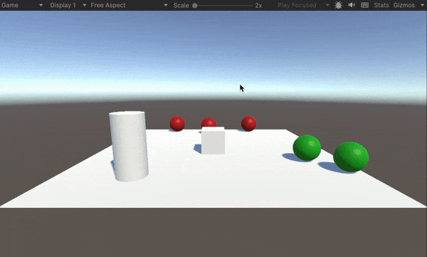
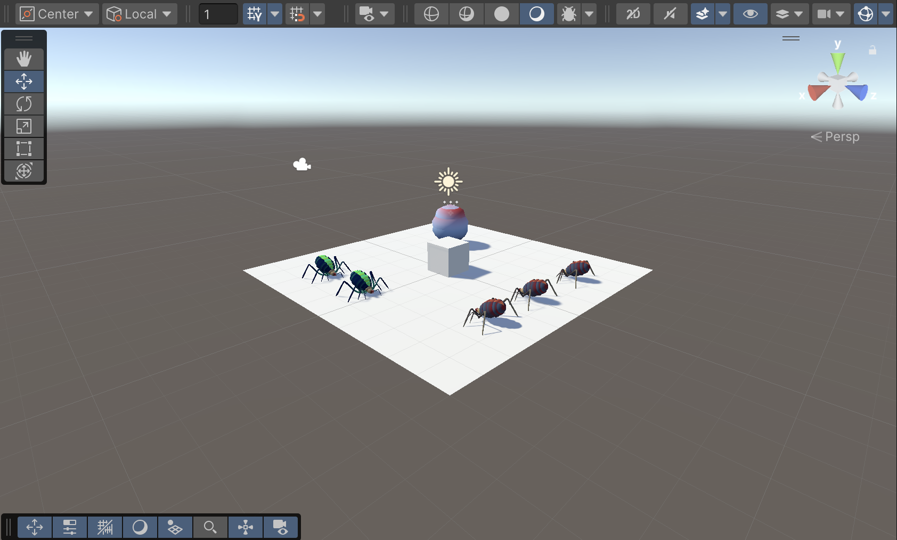
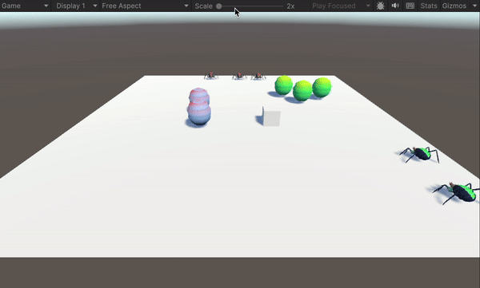

# Práctica 4 - Eventos
En esta práctica vamos a aprender conceptos sobre los eventos en Unity, a través de 9 ejercicios.

### Datos del Alumno
- Igor Dragone
- alu0101469652@ull.edu.es

### Ejercicio 1
En este ejercicio necesitamos una escena con un cubo físico, un cílindro y cinco esferas (2 de tipo 1 y 3 de tipo 2). El objetivo es conseguir que cuando el cubo colisione con el cilindro, las esferas de tipo 1 se dirijan hacia una de las esferas de tipo 2 y las esferas de tipo 2 se desplacen hacia el cilindro. Empezamos, con el cubo: lo hacemos cinemático y le asignamos un script que permita moverle con las flechas. Pasamos al cílindro, que será nuestro Notificador: lo hacemos trigger y le asigamos un script que tenga el método `OnTriggerEnter`, que a su vez lance el evento `OnColisionWithCube`, que consegumos a través del delegado. Ahora es el momento de los suscriptores, es decir, las esferas. Para estas vamos a usar un script con corrutinas, pues estas permiten distribuir la ejecución del código durante varios frames (alternativa al Update). En primer lugar subscribimos los callbacks al notificador, con `CylinderTrigger.OnColisionWithCube += MoveToObject;`. MoveObject es el callback y varía dependiendo del tipo de la esfera: para las del tipo 1 (de color verde), hará que estas se muevan hacia una esfera de tipo 2 a elegir; para las del tipo 2 (de color rojo), hará que estas se muevan hacia el cilindro. Ejecución:

### Ejercicio 2
En este ejercicio simplemente sustituimos las esferas con arañas y el cilindro con el huevo. Para ello importamos el asset Fuga spiders al proyecto y elegimos las arañas verdes y azules para el tipo 1 y las arañas rojas para el tipo 2.

### Ejercicio 3 y 9
En este ejercicio tenemos una escena 5 tipos de objetos físicos: un cubo cinemático, arañas tipo 1 y 2 y huevos tipo 1 y 2. Queremos obtener los siguientes comportamientos:
- Cuando el cubo toca una araña del tipo 2, las arañas en el grupo 1 se acercan a un objeto seleccionado. En este caso seleccioné un huevo de tipo 1. Para conseguir este escenario, he configurado el cubo como notificador y las arañas de tipo 1 como subscriptores, usando otra vez corrutinas para los callbacks.
- Cuando el cubo toca una araña del tipo 1, las arañas del grupo 1 se dirigen hacia los huevos del grupo 2 que serán objetos físico. Si alguna araña colisiona con uno de ellos debe cambiar de color. Repetimos lo mismo que en el escenario anterior. Para cambiar el color, usamos el método `GetComponentInChildren<SkinnedMeshRenderer>()`

Además, para evitar repetir las configuraciones en todos los objetos 3D, he creado un prefab para cada objeto. 

